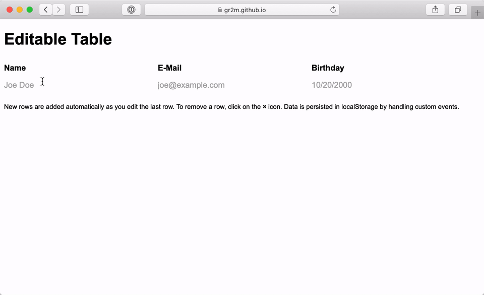

# Editable Table

> A web component for editing a collection of records



## Usage

```html
<!-- Load `editable-table` directly from Pika's CDN -->
<script type="module" src="https://cdn.pika.dev/editable-table"></script>

<!-- put a normal <table> tag inside <editable-table> tags.
     The last <tr> in <tbody> becomes the template for new rows -->
<editable-table>
  <table>
    <thead>
      <tr>
        <th>Name</th>
        <th>E-Mail</th>
        <th colspan="99">Birthday</th>
      </tr>
    </thead>
    <tbody>
      <tr>
        <td>
          <input name="name" placeholder="Joe Doe" autocomplete="off" />
        </td>
        <td>
          <input
            name="email"
            placeholder="joe@example.com"
            type="email"
            autocomplete="off"
          />
        </td>
        <td>
          <input
            name="birthday"
            placeholder="10/20/2000"
            type="date"
            required="required"
            autocomplete="off"
          />
        </td>
        <td>
          <span data-remove>×</span>
        </td>
      </tr>
    </tbody>
  </table>
</editable-table>
```

You can get or add records using the JS API:

```js
const editableTable = document.querySelector("editable-table");
// get records out of table
const records = editableTable.get();
// add a new record to the end of the table
editableTable.add({ name: "Joe", email: "joe@example.com" });
// add a new record after the 2nd
editableTable.add({ name: "Joe", email: "joe@example.com" }, { at: 2 });
// add multiple records at once
editableTable.add(records);

// update 1st row
editableTable.update({ email: "new.joe@example.com" }, { at: 0 });
// remove 3rd row
editableTable.remove({ at: 2 });
```

Or listen to events

```js
editableTable.addEventListener("record:add", ({ record, index }) {});
editableTable.addEventListener("record:update", ({ record, index }) {});
editableTable.addEventListener("record:remove", ({ record, index }) {});
editableTable.addEventListener("record:change", ({ changeType, record, index }) {});
```

## Local Setup

```bash
git clone git@github.com:gr2m/editable-table.git
cd editable-table
npm install
npm start
```

## LICENSE

[MIT](LICENSE)
